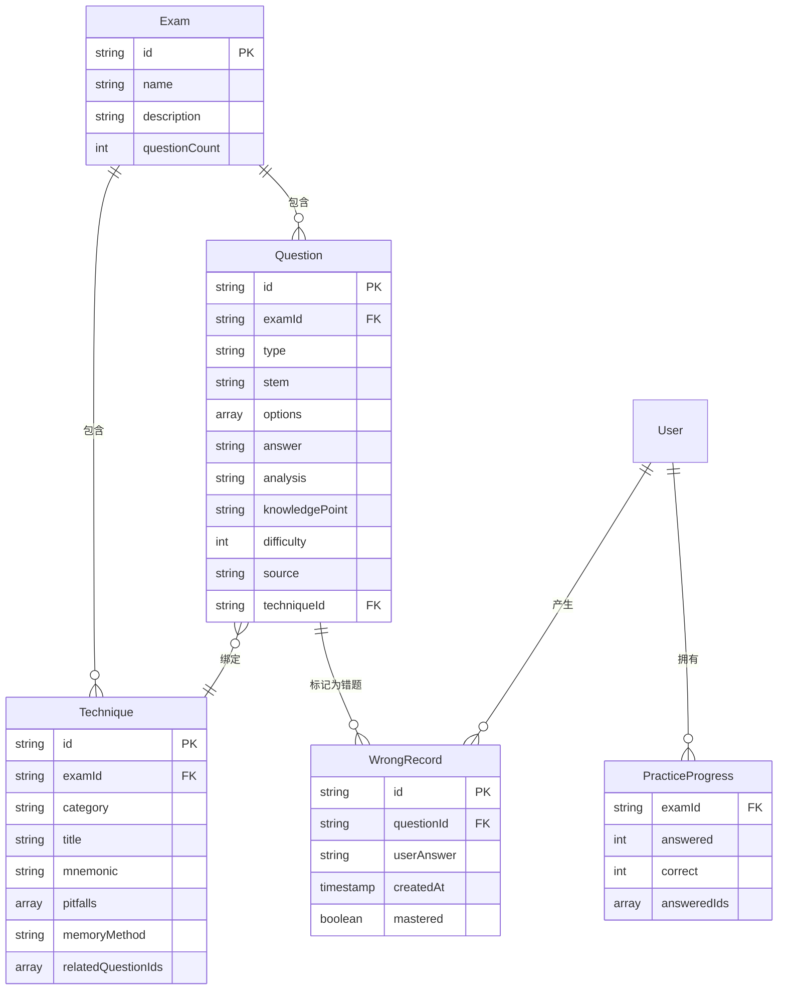

## 1. 架构设计

本项目为纯前端静态应用，部署于 GitHub Pages，无后端服务。前端直接调用知乎搜索 API 与 Agnes API，数据持久化依赖浏览器 LocalStorage。内置示例题库保证无 API 配置时也可完整体验刷题、技巧、导出功能。

```mermaid
flowchart LR
    subgraph "前端层 React + Vite"
        "UI 页面层"
        "状态管理 Zustand"
        "路由 React Router"
    end
    subgraph "数据层"
        "LocalStorage 持久化"
        "内置示例题库"
        "用户题库缓存"
    end
    subgraph "外部服务"
        "知乎搜索 API"
        "Agnes 大模型 API"
    end
    "UI 页面层" --> "状态管理 Zustand"
    "状态管理 Zustand" --> "LocalStorage 持久化"
    "状态管理 Zustand" --> "内置示例题库"
    "UI 页面层" --> "知乎搜索 API"
    "UI 页面层" --> "Agnes 大模型 API"
    "知乎搜索 API" --> "Agnes 大模型 API"
    "Agnes 大模型 API" --> "状态管理 Zustand"
```

## 2. 技术说明
- **前端框架**：React@18 + Vite + TypeScript
- **样式方案**：TailwindCSS@3 + 自定义 CSS 变量（学术编辑风主题）
- **路由**：React Router@6
- **状态管理**：Zustand（轻量，持久化中间件）
- **持久化**：LocalStorage（题库缓存、错题本、API 配置、刷题进度）
- **PDF 导出**：jsPDF + html2canvas
- **JSON 导出**：原生 Blob 下载
- **图标**：lucide-react
- **动效**：Framer Motion（页面切换、卡片入场、技巧浮层）
- **字体**：Cormorant Garamond（标题）、Noto Serif SC（中文正文）、JetBrains Mono（数据）
- **部署**：GitHub Pages（静态构建产物，配置 base 路径）
- **后端**：无（纯静态）
- **数据库**：无（LocalStorage + 内置 JSON 题库）

## 3. 路由定义
| 路由 | 用途 |
|------|------|
| `/` | 首页：Hero 搜索、核心功能展示、热门考试入口、数据统计 |
| `/collect` | 采集中心：API 配置、采集进度、原始素材预览 |
| `/bank` | 题库大厅：题目列表、多维筛选、关键词搜索 |
| `/practice` | 刷题面板：单题答题、即时反馈、技巧展示、进度统计 |
| `/techniques` | 应试技巧：分类导航、技巧详情卡片、关联题目 |
| `/wrongbook` | 错题本：错题列表、重做模式、掌握度统计 |
| `/export` | 导出中心：JSON/PDF 导出、自定义范围、预览 |

## 4. API 定义（前端直连外部服务）

### 4.1 知乎搜索 API 调用
```typescript
interface ZhihuSearchRequest {
  keyword: string;          // 考试关键词，如 "科目一真题"
  page: number;             // 分页
  pageSize: number;         // 每页数量
}

interface ZhihuSearchResponse {
  items: ZhihuPost[];
  total: number;
}

interface ZhihuPost {
  id: string;
  title: string;
  content: string;          // 帖子正文片段
  author: string;
  url: string;
  publishedAt: string;
  voteupCount: number;
}
```

### 4.2 Agnes 大模型 API 调用
```typescript
interface AgnesProcessRequest {
  apiKey: string;
  examName: string;
  rawMaterials: ZhihuPost[];   // 知乎采集的原始素材
  task: 'dedup' | 'standardize' | 'technique';
}

interface AgnesProcessResponse {
  questions: Question[];       // 标准化后的题目
  techniques: Technique[];     // 应试技巧
  knowledgePoints: string[];   // 归纳的知识点
}

interface Question {
  id: string;
  examName: string;
  type: 'single_choice' | 'multi_choice' | 'judge';
  stem: string;                // 题干
  options: string[];           // 选项
  answer: string | string[];   // 正确答案
  analysis: string;            // 解析
  knowledgePoint: string;      // 知识点
  difficulty: 1 | 2 | 3 | 4 | 5;
  source: string;              // 来源帖子
  techniqueId?: string;        // 绑定的技巧 ID
}

interface Technique {
  id: string;
  examName: string;
  category: string;            // 题型/知识点分类
  title: string;               // 技巧标题
  mnemonic: string;            // 秒杀口诀
  pitfalls: string[];          // 避坑要点
  memoryMethod: string;        // 记忆方法
  relatedQuestionIds: string[];// 关联题目
}
```

### 4.3 本地数据结构（LocalStorage）
```typescript
// LocalStorage 键
const STORAGE_KEYS = {
  QUESTION_BANK: 'qbm_question_bank',     // 题库缓存
  WRONG_BOOK: 'qbm_wrong_book',           // 错题本
  PROGRESS: 'qbm_progress',               // 刷题进度
  API_CONFIG: 'qbm_api_config',           // API 配置
  SETTINGS: 'qbm_settings',               // 用户设置
} as const;
```

## 5. 服务端架构图
本项目无后端，纯前端静态部署。所有逻辑在前端完成，外部 API 直连。

## 6. 数据模型

### 6.1 数据模型定义


### 6.2 数据定义语言（内置示例题库 JSON 结构）
```json
{
  "exams": [
    {
      "id": "km1",
      "name": "科目一",
      "description": "机动车驾驶证科目一理论考试",
      "icon": "car"
    }
  ],
  "questions": [
    {
      "id": "q_km1_001",
      "examId": "km1",
      "type": "single_choice",
      "stem": "在道路上驾驶机动车，应当依法取得机动车驾驶证。",
      "options": ["正确", "错误"],
      "answer": "正确",
      "analysis": "《道路交通安全法》规定，驾驶机动车应当依法取得机动车驾驶证。",
      "knowledgePoint": "法律法规",
      "difficulty": 1,
      "source": "知乎网友整理",
      "techniqueId": "t_km1_001"
    }
  ],
  "techniques": [
    {
      "id": "t_km1_001",
      "examId": "km1",
      "category": "限速题",
      "title": "科目一限速口诀",
      "mnemonic": "城3公4，城5公7，城4公3",
      "pitfalls": ["注意区分城市道路与公路", "无中心线 vs 有中心线"],
      "memoryMethod": "城市道路无中心线30，有中心线50；公路无中心线40，有中心线70",
      "relatedQuestionIds": ["q_km1_001"]
    }
  ]
}
```
